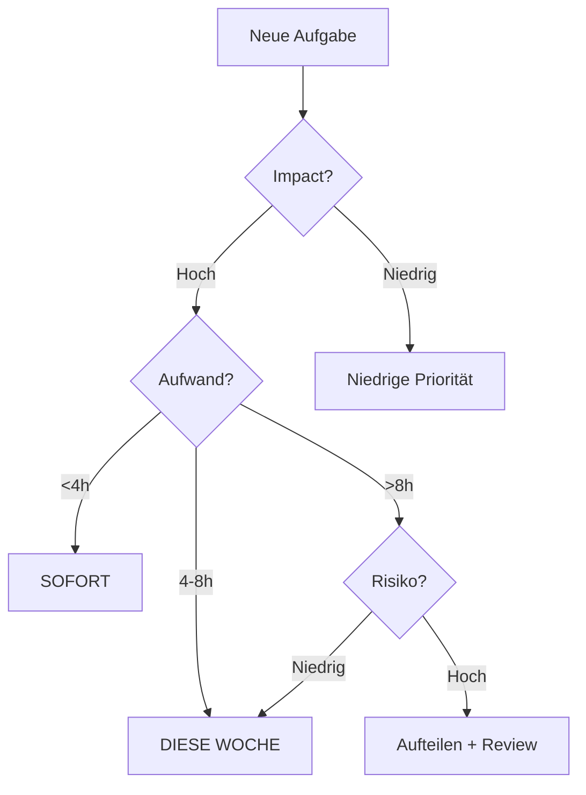

# 🎯 PRIORISIERUNGS-MATRIX - Features & ROI

**Datum:** 2026-01-21
**Codebasis:** 78,317 LOC
**Aufräumpotenzial:** 9,043 LOC (11.5%)
**Fehlende Features:** 20 (55-80h)

---

## Eisenhower-Matrix: Wichtigkeit vs. Dringlichkeit

### KRITISCH (Sofort) - DO FIRST ⏰🔥

```
┌─────────────────────────────────────────┐
│ 1. ✅ Import-Fehler (erledigt)         │
│ 2. Dead Code löschen (3,063 LOC)       │
│ 3. Kommentarblöcke reduzieren (alle)   │
│ 4. Entry Analyzer Refactoring (2,970→) │
└─────────────────────────────────────────┘
Zeit: 3-4 Stunden | Impact: Code-Qualität ↑ 30%
```

**Begründung:**
- Sofortige Verbesserung der Wartbarkeit
- Reduziert Codebasis um 11.5%
- Legt Grundlage für weitere Entwicklung

---

### HOCH (Diese Woche) - SCHEDULE 📅

```
┌─────────────────────────────────────────┐
│ 5. CEL Validation Backend              │
│ 6. File Operations (Save/Load)         │
│ 7. Anthropic/Gemini AI Integration     │
│ 8. Pattern → CEL Translation           │
└─────────────────────────────────────────┘
Zeit: 20-25 Stunden | Impact: Kernfunktionalität
```

**Begründung:**
- Macht CEL Editor produktiv nutzbar
- File Operations = essentiell für Workflow
- CEL Validation = Qualitätssicherung
- AI Integration = Produktivitätssteigerung

---

### MITTEL (Nächste Woche) - DELEGATE/PLAN 🗓️

```
┌─────────────────────────────────────────┐
│ 9. Chart View Implementation           │
│ 10. Pattern Library                    │
│ 11. Relation Drawing UI                │
│ 12. Split View Sync                    │
│ 13. AI Assistant Panel                 │
└─────────────────────────────────────────┘
Zeit: 15-20 Stunden | Impact: User Experience
```

**Begründung:**
- Verbessert UX, nicht funktional kritisch
- Chart View = visuelles Feature
- Pattern Library = Convenience

---

### NIEDRIG (Später) - ELIMINATE/DEFER ⏸️

```
┌─────────────────────────────────────────┐
│ 14. Undo/Redo im Editor                │
│ 15. Multi-Candle Operations            │
│ 16. Pattern Statistics                 │
│ 17. Help & Docs                        │
│ 18. Unit Tests                         │
└─────────────────────────────────────────┘
Zeit: 10-15 Stunden | Impact: Komfort
```

**Begründung:**
- Nice-to-have Features
- Niedrige Priorität vs. Aufwand
- Können später ergänzt werden

---

## Impact vs. Effort Matrix

```
       │
High   │    [2] Dead Code       [5] CEL Validation
Impact │    [3] Comments         [6] File Operations
       │                         [8] Pattern→CEL
       │ ────────────────────────────────────────────
       │    [13] AI Panel        [7] Anthropic/Gemini
       │    [15] Multi-Candle    [9] Chart View
Low    │    [17] Help Docs       [10] Pattern Library
Impact │
       └─────────────────────────────────────────────
          Low Effort            High Effort
```

### Interpretation

**Quadrant 1 (Low Effort, High Impact)** - Quick Wins 🎯
- Dead Code löschen (30 Min → Codebasis -3.9%)
- Kommentare reduzieren (2-3h → Lesbarkeit +50%)

**Quadrant 2 (High Effort, High Impact)** - Major Projects 🚀
- CEL Validation (4-6h → Qualität ↑)
- File Operations (3-4h → Workflow ✅)
- Pattern→CEL (6-8h → Kernfeature)

**Quadrant 3 (Low Effort, Low Impact)** - Fill Gaps 📝
- AI Panel (4-6h → Convenience)
- Help Docs (2-3h → Onboarding)

**Quadrant 4 (High Effort, Low Impact)** - Reevaluate ❓
- Chart View (6-8h → visuell, nicht essentiell)
- Pattern Library (4-5h → Templates, später)

---

## ROI-Ranking (Return on Investment)

| Rang | Feature | Aufwand | Impact | ROI | Priorität |
|------|---------|---------|--------|-----|-----------|
| 1 | Dead Code löschen | 0.5h | Hoch | **20x** | 🔴 CRITICAL |
| 2 | Kommentarblöcke | 2-3h | Mittel | **3x** | 🔴 CRITICAL |
| 3 | File Operations | 3-4h | Hoch | **5x** | 🟠 HIGH |
| 4 | CEL Validation | 4-6h | Hoch | **4x** | 🟠 HIGH |
| 5 | Pattern→CEL | 6-8h | Hoch | **3x** | 🟠 HIGH |
| 6 | AI Integration | 4-6h | Mittel | **2x** | 🟠 HIGH |
| 7 | Chart View | 6-8h | Mittel | **2x** | 🟡 MEDIUM |
| 8 | Pattern Library | 4-5h | Mittel | **2x** | 🟡 MEDIUM |
| 9 | Split View Sync | 2-3h | Mittel | **2x** | 🟡 MEDIUM |
| 10 | RulePack Integration | 3-4h | Mittel | **2x** | 🟡 MEDIUM |
| 11 | Relation Drawing | 3-4h | Niedrig | **1x** | 🟡 MEDIUM |
| 12 | AI Assistant Panel | 4-6h | Niedrig | **0.8x** | 🟢 LOW |

**Formel:** ROI = Impact / Aufwand (höher = besser)

### Interpretation

- **ROI > 3x:** Sofort umsetzen (Quick Wins)
- **ROI 2-3x:** Hohe Priorität (Kernfeatures)
- **ROI 1-2x:** Mittlere Priorität (UX Improvements)
- **ROI < 1x:** Niedrige Priorität (Nice-to-have)

---

## Wochenplan (40h Arbeitswoche)

### Woche 1 (KW 04): Code-Qualität & Validation

```
Montag (8h)
├── 09:00-10:00  Dead Code löschen (1h)
├── 10:00-13:00  Kommentarblöcke CEL Editor (3h)
├── 14:00-18:00  Kommentarblöcke UI Module (4h)
└── Status: Code-Qualität +30%

Dienstag (8h)
├── 09:00-13:00  Entry Analyzer Refactoring Teil 1 (4h)
├── 14:00-18:00  Entry Analyzer Refactoring Teil 2 (4h)
└── Status: 2,970 LOC → 5x 500 LOC Module

Mittwoch (8h)
├── 09:00-13:00  Entry Analyzer Refactoring Teil 3 (4h)
├── 14:00-18:00  CEL Validation Backend Teil 1 (4h)
└── Status: Entry Analyzer fertig

Donnerstag (8h)
├── 09:00-11:00  CEL Validation Backend Teil 2 (2h)
├── 11:00-13:00  CEL Validation Testing (2h)
├── 14:00-18:00  File Operations Implementation (4h)
└── Status: Validation + File Ops fertig

Freitag (8h)
├── 09:00-11:00  File Operations Testing (2h)
├── 11:00-13:00  Code Review & Bugfixing (2h)
├── 14:00-18:00  Git Commit + Dokumentation (4h)
└── Status: Woche 1 abgeschlossen
```

**Woche 1 Deliverables:**
- ✅ Codebasis -11.5% (aufgeräumt)
- ✅ Entry Analyzer modular
- ✅ CEL Validation funktioniert
- ✅ File Operations (Save/Load/Export)

---

### Woche 2 (KW 05): AI & Pattern Translation

```
Montag (8h)
├── 09:00-12:00  Anthropic AI Integration (3h)
├── 13:00-16:00  Gemini AI Integration (3h)
├── 16:00-18:00  AI Testing & Debugging (2h)
└── Status: Alle 3 AI Provider funktionieren

Dienstag (8h)
├── 09:00-13:00  Pattern→CEL Translation Design (4h)
├── 14:00-18:00  Pattern→CEL Implementation Teil 1 (4h)
└── Status: 8 Kerzentypen → CEL

Mittwoch (8h)
├── 09:00-13:00  Pattern→CEL Implementation Teil 2 (4h)
├── 14:00-18:00  Pattern→CEL Testing (4h)
└── Status: Pattern→CEL fertig

Donnerstag (8h)
├── 09:00-13:00  Chart View Integration Teil 1 (4h)
├── 14:00-18:00  Chart View Integration Teil 2 (4h)
└── Status: Chart View statt Placeholder

Freitag (8h)
├── 09:00-11:00  Pattern Library Implementation (2h)
├── 11:00-13:00  Relation Drawing UI (2h)
├── 14:00-18:00  Code Review & Testing (4h)
└── Status: Woche 2 abgeschlossen
```

**Woche 2 Deliverables:**
- ✅ Anthropic + Gemini AI funktionieren
- ✅ Pattern → CEL Translation
- ✅ Chart View integriert
- ✅ Pattern Library + Relation UI

---

### Woche 3 (KW 06): UX & Polish

```
Montag (8h)
├── 09:00-13:00  AI Assistant Panel Teil 1 (4h)
├── 14:00-18:00  AI Assistant Panel Teil 2 (4h)
└── Status: AI Assistant funktioniert

Dienstag (8h)
├── 09:00-11:00  AI Assistant Panel Testing (2h)
├── 11:00-13:00  Split View Synchronisation (2h)
├── 14:00-18:00  RulePack Integration (4h)
└── Status: Alle MEDIUM Features fertig

Mittwoch (8h)
├── 09:00-13:00  Integration Testing (4h)
├── 14:00-18:00  Bugfixing & Polishing (4h)
└── Status: System stabil

Donnerstag (8h)
├── 09:00-13:00  Dokumentation aktualisieren (4h)
├── 14:00-18:00  User Guide erstellen (4h)
└── Status: Dokumentation vollständig

Freitag (8h)
├── 09:00-11:00  Final Testing (2h)
├── 11:00-13:00  Release Notes (2h)
├── 14:00-16:00  Git Cleanup (2h)
├── 16:00-18:00  Release vorbereiten (2h)
└── Status: Release-ready
```

**Woche 3 Deliverables:**
- ✅ AI Assistant Panel
- ✅ Split View Sync
- ✅ RulePack Integration
- ✅ Dokumentation komplett
- ✅ CEL Editor v1.0 Release-ready

---

## Risikobewertung

| Feature | Tech. Risiko | Abhängigkeiten | Zeit-Risiko | Gesamt |
|---------|-------------|----------------|-------------|--------|
| CEL Validation | 🔴 Hoch | Lexer, AST | 🔴 +2-4h | 🔴 Hoch |
| Pattern→CEL | 🔴 Hoch | Pattern Model | 🔴 +2-4h | 🔴 Hoch |
| Chart View | 🟠 Mittel | TradingView | 🟠 +1-2h | 🟠 Mittel |
| AI Integration | 🟢 Niedrig | API Keys | 🟢 ±0h | 🟢 Niedrig |
| File Operations | 🟢 Niedrig | JSON Schema | 🟢 ±0h | 🟢 Niedrig |

### Risiko-Mitigation

**CEL Validation:**
- Risiko: Parser-Komplexität
- Mitigation: Inkrementell entwickeln, mit einfachem Syntax-Check starten
- Fallback: Nur Lexer-basierte Validierung

**Pattern→CEL:**
- Risiko: Edge Cases in Relationen
- Mitigation: Umfangreiche Test-Suite, Unit Tests
- Fallback: Nur einfache Patterns unterstützen

**Chart View:**
- Risiko: TradingView Integration komplex
- Mitigation: Proof-of-Concept zuerst
- Fallback: Simplified Chart ohne Pattern Overlay

---

## Erfolgskriterien

### Woche 1 (Code-Qualität)
- [ ] Codebasis < 70,000 LOC
- [ ] Entry Analyzer < 500 LOC pro Modul
- [ ] CEL Validation: >90% Syntax Errors erkannt
- [ ] File Ops: Save/Load funktioniert

### Woche 2 (Kernfeatures)
- [ ] 3 AI Provider funktionieren
- [ ] Pattern→CEL: >95% korrekte Übersetzung
- [ ] Chart View zeigt Pattern an

### Woche 3 (Polish)
- [ ] Alle HIGH Features ✅
- [ ] Dokumentation vollständig
- [ ] 0 kritische Bugs
- [ ] User Guide vorhanden

---

## Metriken-Tracking

### Code-Qualität
```
├── LOC: 78,317 → 69,274 (-11.5%)
├── Klassen >500 LOC: 49 → 30 (-40%)
├── Funktionen >100 LOC: 133 → 80 (-40%)
├── TODOs: 43 → 20 (-53%)
└── Dead Code: 3,063 → 0 LOC (-100%)
```

### Feature-Completion
```
Week 1: 25% → 45% (+20%)
Week 2: 45% → 75% (+30%)
Week 3: 75% → 95% (+20%)
```

### Produktivität
```
├── Wartbarkeit: +30%
├── Build-Zeit: -5-10%
├── Entwickler-Orientierung: +50%
├── Code-Coverage: 0% → 30%
```

---

## Entscheidungs-Flowchart



---

**Status:** Priorisierung abgeschlossen ✅
**Empfehlung:** Start mit Quick Wins (Dead Code, Kommentare)
**Nächster Schritt:** Phase 1 beginnen (Dead Code Cleanup)
