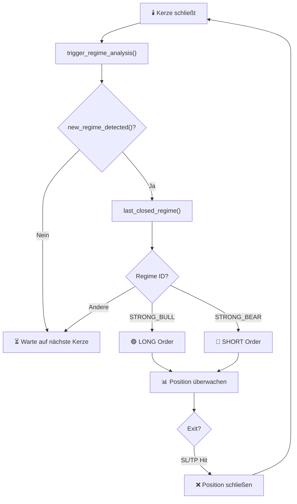
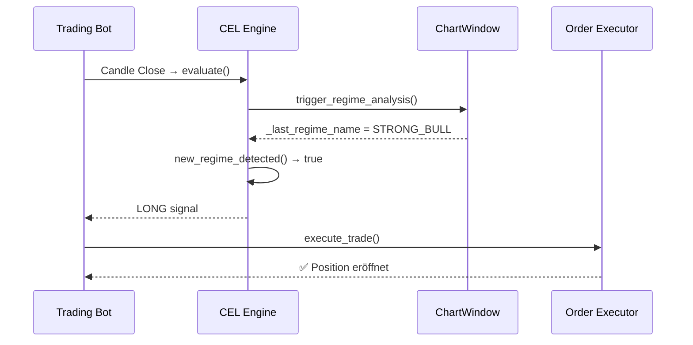

# CEL Regime Entry Pipeline - Dokumentation

**Export für: OrderPilot-AI Trading Bot**
**Datum:** 2026-01-30
**Version:** 1.0

---

## 1. Übersicht

Das CEL (Common Expression Language) Regime Entry System ermöglicht automatische Trade-Entries basierend auf erkannten Marktregimes.

### Workflow

```
Kerze schließt → Regime-Erkennung → Regime-Wechsel? → Entry-Signal
```

### Flowchart (Mermaid)



### Sequence Diagram (Mermaid)



> **💡 Mermaid rendern:**
> - [mermaid.live](https://mermaid.live/) - Im Browser
> - VS Code: "Markdown Preview Mermaid Support"
> - Google: [Mermaid Diagram App](https://workspace.google.com/marketplace/app/mermaid/636321283856)

---

## 2. CEL Funktionen

| Funktion | Beschreibung | Rückgabe |
|----------|--------------|----------|
| `trigger_regime_analysis()` | Führt Regime-Erkennung auf Chart aus | `true`/`false` |
| `new_regime_detected()` | Prüft ob Regime sich geändert hat | `true`/`false` |
| `last_closed_regime()` | Regime-ID der letzten geschlossenen Kerze | z.B. `'STRONG_BULL'` |

---

## 3. Entry Expression (JSON)

```cel
trigger_regime_analysis() && new_regime_detected() && (
  (side == 'long' && last_closed_regime() == 'STRONG_BULL')
  ||
  (side == 'short' && last_closed_regime() == 'STRONG_BEAR')
)
```

### Erklärung

1. **`trigger_regime_analysis()`** - MUSS zuerst aufgerufen werden
   - Aktualisiert `chart_window._last_regime_name`
   - Zeichnet Regime-Linien auf Chart

2. **`new_regime_detected()`** - Optional aber empfohlen
   - Verhindert wiederholte Entries im gleichen Regime
   - Vergleicht vorheriges vs. aktuelles Regime

3. **`last_closed_regime()`** - Liefert Regime-ID
   - Liest aus ChartWindow nach `trigger_regime_analysis()`
   - Mögliche Werte: `STRONG_BULL`, `STRONG_BEAR`, `BULL`, `BEAR`, `SIDEWAYS`, etc.

---

## 4. Regime-IDs (aus JSON)

| ID | Name | Priorität | Entry |
|----|------|-----------|-------|
| `STRONG_TF` | Extremer Trend | 100 | ✅ |
| `STRONG_BULL` | Starker Aufwärtstrend | 95 | ✅ Long |
| `STRONG_BEAR` | Starker Abwärtstrend | 94 | ✅ Short |
| `TF` | Trend Following | 85 | ⚠️ |
| `BULL` | Aufwärtstrend | 80 | - |
| `BEAR` | Abwärtstrend | 79 | - |
| `SIDEWAYS` | Seitwärts | 50 | ❌ |

---

## 5. Order-Ausführung

Bei erfüllter CEL-Bedingung:

### Long Entry
- Bedingung: `last_closed_regime() == 'STRONG_BULL'`
- Order: BUY Market Order
- SL: Entry - 2x ATR
- TP: Entry + 3x ATR

### Short Entry
- Bedingung: `last_closed_regime() == 'STRONG_BEAR'`
- Order: SELL Market Order
- SL: Entry + 2x ATR
- TP: Entry - 3x ATR

---

## 6. Verwendung

### Schritt 1: Regime JSON laden
```
Entry Analyzer → Tab Regime → Load → JSON auswählen
```

### Schritt 2: Regime analysieren
```
Entry Analyzer → Analyze Visible Range
```

### Schritt 3: Bot starten
```
Trading Bot → Tab Bot → Start Bot (JSON)
```

---

## 7. Geänderte Dateien

| Datei | Änderung |
|-------|----------|
| `cel_engine.py` | `last_closed_regime()`, `new_regime_detected()` |
| `cel_function_palette.py` | UI für neue Funktionen |
| `bot_tab_control_pipeline.py` | ChartWindow-Lookup |
| `bot_tab_control_trade.py` | JSON Entry Validierung + ATR SL/TP |
| `260130...json` | entry_expression mit `new_regime_detected()` |

---

## 8. Erweiterungsmöglichkeiten

- [ ] Weitere Regime-IDs für Entry hinzufügen (`TF`, `BULL_EXHAUSTION`)
- [ ] Dynamische SL/TP-Multiplikatoren aus JSON
- [ ] Exit-Expression für Regime-basierte Exits
- [ ] Trailing Stop bei Regime-Wechsel

---

*Generiert von OrderPilot-AI CEL Engine*
