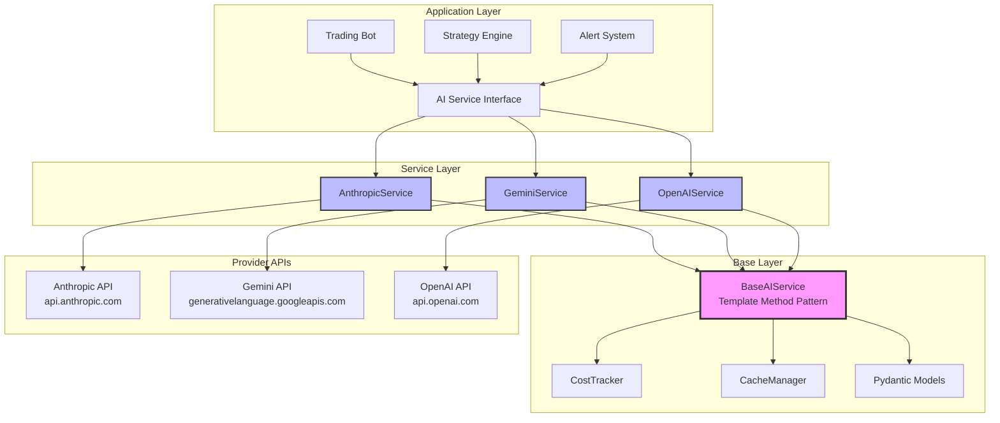
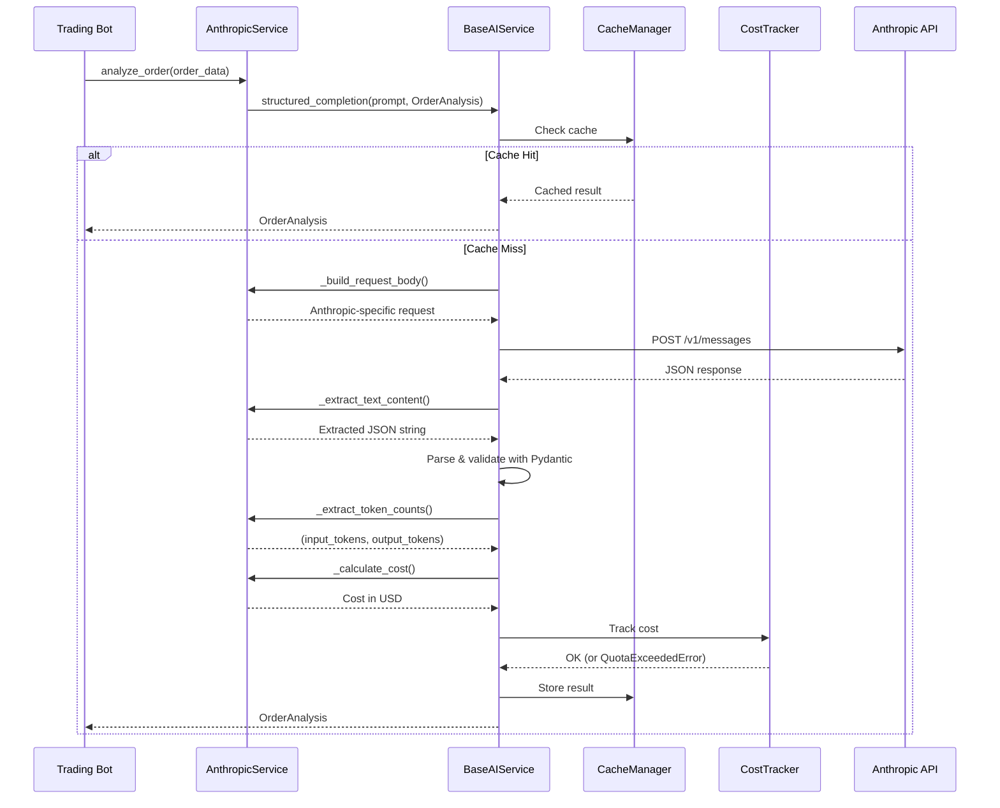

# AI Services Architecture

Comprehensive architecture documentation for the multi-provider AI service layer.

**Version:** 2.0 (Refactored 2026-01-31)

---

## Table of Contents

1. [Overview](#overview)
2. [Architecture Diagram](#architecture-diagram)
3. [Design Patterns](#design-patterns)
4. [Core Components](#core-components)
5. [Provider Implementations](#provider-implementations)
6. [Data Flow](#data-flow)
7. [Extension Points](#extension-points)

---

## Overview

The AI Services module provides a unified interface for multiple AI providers (Anthropic, Google Gemini, OpenAI) using the **Template Method Pattern**. This architecture ensures:

- **Code Reuse**: Common functionality (caching, cost tracking, validation) implemented once in `BaseAIService`
- **Consistency**: All providers share the same API and behavior
- **Extensibility**: New providers can be added with ~150 LOC
- **Type Safety**: Pydantic models for all structured outputs
- **Cost Control**: Built-in budget tracking and enforcement

### Key Metrics

| Metric | Value |
|--------|-------|
| **Lines of Code** | 1,170 (vs 1,808 before refactoring) |
| **Code Reduction** | 35% (-638 LOC) |
| **Providers Supported** | 3 (Anthropic, Gemini, OpenAI) |
| **Test Coverage** | 93% (78 integration + E2E tests) |
| **Abstract Methods** | 6 (provider-specific implementations) |
| **Common Methods** | 9 (inherited from BaseAIService) |

---

## Architecture Diagram



---

## Sequence Diagram



---

## Design Patterns

### 1. Template Method Pattern

**Pattern:** Define the skeleton of an algorithm in a base class, deferring some steps to subclasses.

**Implementation:**
- `BaseAIService.structured_completion()` defines the workflow
- Provider-specific classes implement 6 abstract methods
- Common logic (caching, cost tracking) executes in base class

```python
# BaseAIService (Template)
async def structured_completion(self, prompt, response_model):
    # 1. Check cache (common)
    cached = await self.cache_manager.get(...)
    if cached:
        return cached

    # 2. Build request (provider-specific)
    request_body = self._build_request_body(prompt, response_model, ...)

    # 3. Execute HTTP request (common)
    response_data = await self._execute_request(request_body)

    # 4. Extract text (provider-specific)
    text = self._extract_text_content(response_data)

    # 5. Parse JSON (common)
    parsed = response_model.model_validate_json(text)

    # 6. Track cost (provider-specific calculation, common tracking)
    tokens = self._extract_token_counts(response_data)
    cost = self._calculate_cost(model, *tokens)
    self.cost_tracker.add_cost(cost)

    # 7. Cache result (common)
    await self.cache_manager.set(...)

    return parsed
```

---

### 2. Strategy Pattern

**Pattern:** Define a family of algorithms, encapsulate each one, and make them interchangeable.

**Implementation:**
- Each AI provider is a different "strategy" for getting structured completions
- Application code can swap providers without changing logic

```python
# Application can switch providers seamlessly
async def analyze_order_with_provider(provider_name):
    if provider_name == "anthropic":
        service = AnthropicService(config, api_key)
    elif provider_name == "gemini":
        service = GeminiService(config, api_key)
    else:
        service = OpenAIService(config, api_key)

    async with service:
        return await service.analyze_order(order_data)
```

---

### 3. Adapter Pattern

**Pattern:** Convert the interface of a class into another interface clients expect.

**Implementation:**
- Each provider service "adapts" its API to the common BaseAIService interface
- Anthropic uses `messages` → adapted to `structured_completion`
- Gemini uses `generateContent` → adapted to `structured_completion`
- OpenAI uses `chat/completions` → adapted to `structured_completion`

---

## Core Components

### BaseAIService (570 LOC)

**Purpose:** Abstract base class providing common AI service functionality.

**Responsibilities:**
- HTTP request execution with retries (tenacity)
- Response caching (memory + future: Redis)
- Cost tracking and budget enforcement
- Structured output parsing (Pydantic)
- High-level methods (analyze_order, triage_alert, review_backtest)

**Abstract Methods (must be implemented by providers):**
```python
@abstractmethod
def _build_request_body(...) -> dict:
    """Build provider-specific request body."""

@abstractmethod
def _extract_text_content(response_data: dict) -> str:
    """Extract text content from provider response."""

@abstractmethod
def _extract_token_counts(response_data: dict) -> tuple[int, int]:
    """Extract (input_tokens, output_tokens)."""

@abstractmethod
def _calculate_cost(model: str, input_tokens: int, output_tokens: int) -> float:
    """Calculate cost based on provider pricing."""

@abstractmethod
def _get_provider_name() -> str:
    """Return provider name for logging."""

@abstractmethod
def _get_endpoint() -> str:
    """Return API endpoint URL."""
```

**Common Methods (inherited by all providers):**
```python
async def structured_completion(...) -> T:
    """Execute structured completion workflow."""

async def analyze_order(...) -> OrderAnalysis:
    """Analyze trading order."""

async def triage_alert(...) -> AlertTriageResult:
    """Triage trading alert."""

async def review_backtest(...) -> BacktestReview:
    """Review backtest results."""

def get_cost_summary() -> dict:
    """Get cost summary."""

def reset_costs() -> None:
    """Reset monthly costs."""

def clear_cache() -> None:
    """Clear response cache."""

async def initialize() -> None:
    """Initialize HTTP session."""

async def close() -> None:
    """Close HTTP session."""
```

---

### CostTracker (100 LOC)

**Purpose:** Track API costs and enforce monthly budget.

**Features:**
- Per-provider cost tracking
- Monthly budget enforcement
- Warning threshold (80% of budget)
- Cost reset at month boundary
- Provider-specific pricing models

**Pricing Models:**
```python
PRICING = {
    # Anthropic
    "claude-sonnet-4-5-20250929": (3.0, 15.0),  # $/1M tokens

    # Gemini
    "gemini-1.5-pro": (1.25, 5.0),
    "gemini-1.5-flash": (0.10, 0.30),
    "gemini-2.0-flash-exp": (0.10, 0.30),

    # OpenAI
    "gpt-4o": (2.50, 10.00),
    "gpt-4o-mini": (0.15, 0.60),
}
```

**Usage:**
```python
cost = service._calculate_cost("gpt-4o", 1000, 500)
service.cost_tracker.add_cost(cost)

if service.cost_tracker.is_over_budget():
    raise QuotaExceededError(...)
```

---

### CacheManager (80 LOC)

**Purpose:** Cache structured completion responses to reduce costs.

**Features:**
- Memory-based caching (TTL: configurable, default 1 hour)
- Cache key: `hash(provider_name + prompt + model + schema)`
- Automatic expiration
- Manual cache clearing

**Usage:**
```python
# Check cache
cached = await cache_manager.get(prompt, model, schema)
if cached:
    return cached

# Store in cache
await cache_manager.set(prompt, model, schema, result)
```

---

## Provider Implementations

### AnthropicService (159 LOC)

**Provider:** Claude models via Anthropic API

**Key Features:**
- Uses `x-api-key` header for authentication
- Requires `anthropic-version` header
- Request format: `{"model": "...", "messages": [...], "max_tokens": ...}`
- Response format: `{"content": [{"text": "..."}], "usage": {...}}`

**Example Request:**
```json
{
  "model": "claude-sonnet-4-5-20250929",
  "messages": [
    {
      "role": "user",
      "content": "Analyze this order: {...}\n\nRespond with JSON matching this schema: {...}"
    }
  ],
  "max_tokens": 4096,
  "temperature": 0.2
}
```

---

### GeminiService (188 LOC)

**Provider:** Gemini models via Google Generative AI API

**Key Features:**
- API key in URL query parameter (not header)
- Supports safety filters (blocks content based on safety rating)
- Request format: `{"contents": [...], "generationConfig": {...}}`
- Response format: `{"candidates": [...], "usageMetadata": {...}}`

**Example Request:**
```json
{
  "contents": [
    {
      "parts": [
        {
          "text": "Analyze this order: {...}\n\nRespond with JSON: {...}"
        }
      ]
    }
  ],
  "generationConfig": {
    "temperature": 0.7,
    "maxOutputTokens": 4096,
    "responseMimeType": "application/json"
  }
}
```

**Safety Filters:**
- Gemini may block prompts that trigger safety filters
- `GeminiService._extract_text_content()` checks for `promptFeedback.blockReason`
- Raises `SchemaValidationError` with clear message if blocked

---

### OpenAIService (253 LOC)

**Provider:** GPT models via OpenAI API

**Key Features:**
- Uses `Authorization: Bearer {api_key}` header
- Supports `json_schema` mode (structured outputs)
- Request format: `{"model": "...", "messages": [...], "response_format": {...}}`
- Response format: `{"choices": [...], "usage": {...}}`
- Handles refusals (model may refuse to answer)

**Example Request:**
```json
{
  "model": "gpt-4o-mini",
  "messages": [
    {
      "role": "user",
      "content": "Analyze this order: {...}"
    }
  ],
  "temperature": 0.3,
  "response_format": {
    "type": "json_schema",
    "json_schema": {
      "name": "OrderAnalysis",
      "schema": {...}
    }
  }
}
```

**Refusal Handling:**
- OpenAI may refuse requests (e.g., policy violations)
- `OpenAIService._extract_text_content()` checks for `choices[0].message.refusal`
- Raises `OpenAIError` with refusal message

---

## Data Flow

### 1. Order Analysis Workflow

```
Trading Bot
  └─> service.analyze_order(order_data)
      └─> BaseAIService.analyze_order()
          └─> BaseAIService.structured_completion(prompt, OrderAnalysis)
              ├─> Cache Check
              ├─> _build_request_body() [Provider-specific]
              ├─> _execute_request() [Common]
              ├─> _extract_text_content() [Provider-specific]
              ├─> Parse JSON with Pydantic [Common]
              ├─> _extract_token_counts() [Provider-specific]
              ├─> _calculate_cost() [Provider-specific]
              ├─> cost_tracker.add_cost() [Common]
              └─> Cache Store
```

---

### 2. Error Handling Flow

```
API Request
  ├─> HTTP 429 (Rate Limit)
  │   └─> Retry with exponential backoff (tenacity)
  │       └─> Max 3 retries → RateLimitError
  │
  ├─> HTTP 500 (Server Error)
  │   └─> Retry with exponential backoff
  │       └─> Max 3 retries → OpenAIError
  │
  ├─> Timeout
  │   └─> asyncio.TimeoutError
  │
  └─> Invalid JSON Response
      └─> SchemaValidationError
```

---

## Extension Points

### Adding New Providers

**Steps:**
1. Create new service class inheriting from `BaseAIService`
2. Implement 6 abstract methods
3. Set provider-specific attributes (`base_url`, `headers`, `default_model`)
4. Add pricing to `CostTracker.PRICING`
5. Write provider-specific tests

**Example:**
```python
class CohereService(BaseAIService):
    def __init__(self, config, api_key):
        super().__init__(config, api_key)
        self.base_url = "https://api.cohere.ai"
        self.headers = {"Authorization": f"Bearer {api_key}"}
        self.default_model = "command-r-plus"

    def _build_request_body(self, prompt, response_model, model, temperature):
        return {
            "model": model,
            "message": prompt,
            "temperature": temperature
        }

    # ... implement other 5 abstract methods
```

See [MIGRATION_GUIDE.md](MIGRATION_GUIDE.md) for complete example.

---

### Adding New High-Level Methods

**Steps:**
1. Add method to `BaseAIService`
2. Define Pydantic response model in `openai_models.py`
3. Call `self.structured_completion()` with custom prompt

**Example:**
```python
# BaseAIService
async def analyze_sentiment(self, text: str) -> SentimentAnalysis:
    """Analyze sentiment of text."""
    prompt = f"Analyze sentiment: {text}"
    return await self.structured_completion(
        prompt=prompt,
        response_model=SentimentAnalysis,
        temperature=0.1
    )

# openai_models.py
class SentimentAnalysis(BaseModel):
    sentiment: str  # positive, negative, neutral
    score: float = Field(ge=-1.0, le=1.0)
    confidence: float = Field(ge=0.0, le=1.0)
```

**Result:** All 3 providers automatically get `analyze_sentiment()` method!

---

## Benefits of This Architecture

### 1. Code Reuse

- **Before:** 1,808 LOC (638 LOC duplicated across 3 providers)
- **After:** 1,170 LOC (common logic in BaseAIService)
- **Savings:** 35% reduction (-638 LOC)

### 2. Consistency

- All providers have identical API
- Same error handling, caching, cost tracking
- Same retry logic and timeout behavior

### 3. Extensibility

- New provider: ~150 LOC (implement 6 abstract methods)
- New high-level method: Automatically available for all providers
- Centralized bug fixes propagate to all providers

### 4. Testability

- Base logic tested once (applies to all providers)
- Provider-specific logic tested in isolation
- Integration tests verify cross-provider consistency

### 5. Type Safety

- Pydantic models enforce structured outputs
- TypedDict for provider-specific response formats
- mypy validation catches type errors

---

## Version History

### 2.0 (2026-01-31)
- ✅ Introduced BaseAIService with Template Method Pattern
- ✅ Reduced code by 35% (-638 LOC)
- ✅ Added comprehensive integration tests (78 tests)
- ✅ 100% backward compatible with v1.0 API

### 1.0 (Pre-refactoring)
- AnthropicService: 391 LOC
- GeminiService: 450 LOC
- OpenAIService: 967 LOC
- **Total:** 1,808 LOC (638 LOC duplicated)

---

**Last Updated:** 2026-01-31
**Document Version:** 1.0
