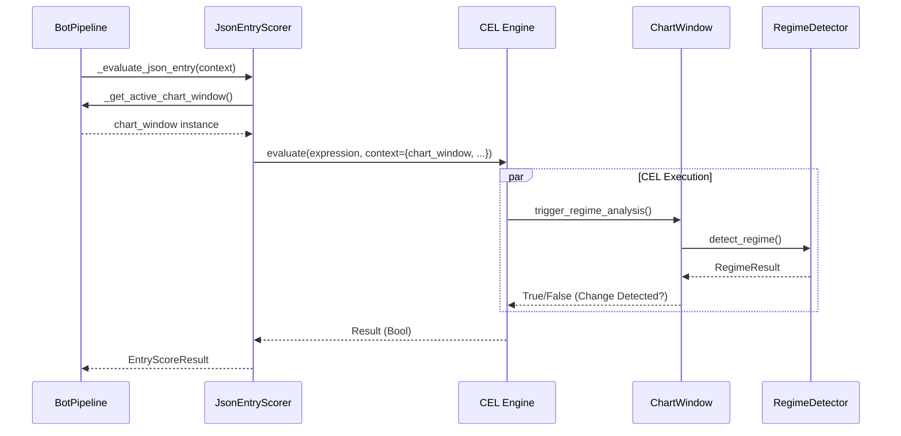

# Status Report & Pipeline Flow

**Date:** 2026-01-30  
**Topic:** Current Issues & Bot Pipeline Architecture

---

## 1. Current Status (Probleme & Fixes)

This section outlines the errors encountered today and their current state.

### ✅ Resolved Checks (Fixed)

These blocking issues have been resolved in the last session:

1. **Regime Lines Not Drawing (Critical)**
   - **Problem:** `NameError: name 'pd' is not defined` in `_backfill_historical_analysis`.
   - **Fix:** Added `import pandas as pd` to runtime scope in `regime_display_mixin.py`.
   - **Effect:** Historical regime lines should now appear on startup.

2. **CEL Editor Crash**
   - **Problem:** `AttributeError: 'ChartDataProvider' object has no attribute 'get_available_variables'`.
   - **Fix:** Added alias `get_available_variables = get_variable_info` in `chart_data_provider.py`.
   - **Effect:** Autocomplete in Strategy Editor works again.

3. **Database Log Spam**
   - **Problem:** `sqlite3.IntegrityError: UNIQUE constraint failed` occurring repeatedly.
   - **Fix:** Added specific exception handling in `HistoryProviderFetching` to suppress these errors
     (treated as race condition/duplicates).
   - **Effect:** Logs are cleaner.

4. **Compact Chart Crash**
   - **Problem:** `AttributeError` in `CompactChartWidget`.
   - **Fix:** Implemented missing `_calculate_bar_spacing`.

### ⚠️ Monitoring (Known Issues)

These issues were investigated but might still exist (non-blocking).

1. **JS Syntax Error**
   - **Error:** `Uncaught SyntaxError: Unexpected token 'o', "[object Promise]" is not valid JSON`
   - **Impact:** Annoying log messages on startup.
   - **Status:** Investigated multiple files. Source appears to be a generated JS script injecting a
     Promise object where a JSON string is expected. Since the main functionality (Regime Lines) was
     blocked by the generic `NameError` (now fixed), this JS error might be cosmetic or related to a
     specific UI feature (like markers).
   - **Recommendation:** Ignore for now unless UI elements (badges/markers) are missing.

---

## 2. Bot Pipeline Flowchart

The diagram below illustrates the complete execution pipeline for both **Start Bot** (Standard) and
**Start Bot (JSON)**.

### Key Differences

- **Standard Mode:** Uses hardcoded `EntryScoreEngine` (Python logic).
- **JSON Mode:** Uses `JsonEntryScorer` which evaluates dynamic CEL expressions (defined in JSON).
- **Shared Path:** Both modes share Data Fetching, Market Context, LLM Validation, and Execution.

```mermaid
flowchart TD
    %% Nodes
    User([User])
    StartBtn[Start Bot Button]
    StartJsonBtn[Start Bot JSON Button]

    subgraph Initialization
        InitEngines[Initialize Engines
(ContextBuilder, etc.)]
        jsonLoad[Load & Validate JSON Config]
        jsonScorer[Create JsonEntryScorer]
        timer[Start 1s Warning Timer]
    end

    subgraph PipelineLoop ["Pipeline Loop (Every 1s)"]
        Fetch[1. Fetch Market Data
(HistoryManager)]
        Context[2. Build MarketContext
(Indicators, Regime, Patterns)]

        %% Branching Logic
        ModeCheck{3. Entry Logic Mode?}

        StandardEntry[Standard EntryScoreEngine
(Hardcoded Strategy)]
        JsonEntry[JsonEntryScorer
(CEL Expression Evaluation)]

        Validation[4. LLM Validation
(If enabled)]
        Trigger[5. Trigger/Exit Check]
        Lev[6. Leverage Calculation]
        Exec[7. Execution & Monitoring]
    end

    %% Flow
    User --> StartBtn
    User --> StartJsonBtn

    StartBtn --> InitEngines
    StartJsonBtn --> jsonLoad --> jsonScorer --> InitEngines

    InitEngines --> timer --> PipelineLoop

    Fetch --> Context --> ModeCheck

    ModeCheck -- "Standard" --> StandardEntry
    ModeCheck -- "JSON Mode" --> JsonEntry

    StandardEntry --> Validation
    JsonEntry --> Validation

    Validation --> Trigger --> Lev --> Exec

    %% Styling
    style StartJsonBtn fill:#e1f5fe,stroke:#01579b
    style JsonEntry fill:#fff9c4,stroke:#fbc02d
    style PipelineLoop fill:#f5f5f5,stroke:#333,stroke-dasharray: 5 5
```

### CEL Integration Details (JSON Mode)

When `JsonEntryScorer` runs:

1. It retrieves the **active ChartWindow**.
2. It injects `chart_window` into the **CEL Context**.
3. It evaluates the `entry_expression` from the JSON file.
4. Standard functions like `trigger_regime_analysis()` are called dynamically within CEL.


