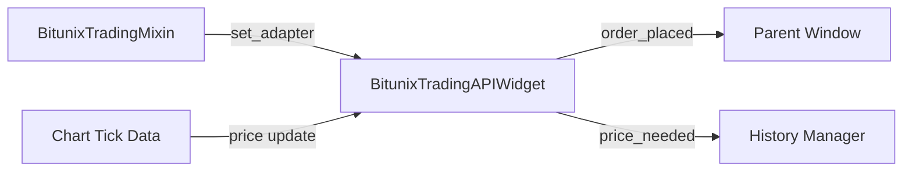

# Bitunix Trading API Widget

## Überblick

Das **Bitunix Trading API Widget** ist eine kompakte Orderaufgabe-Oberfläche, die in den "Trading Bot" → "Signals" Tab integriert ist. Es bietet schnellen Zugriff auf die wichtigsten Trading-Funktionen mit automatischer Berechnung zwischen Stückzahl und Volumen.

## Position im Layout

```
┌──────────────────────────────────────────────────────────────────────────┐
│ Trading Bot Window - Signals Tab                                         │
├──────────────────┬─────────────────────────────────┬─────────────────────┤
│ Bitunix Trading  │  Bitunix HEDGE Execution        │  Current Position  │
│ API              │  (Connection, Entry, TP/SL)     │  (Position Details)│
│ (NEW!)           │                                 │                    │
│ ~280px           │  (Stretch)                      │  420px fixed       │
└──────────────────┴─────────────────────────────────┴─────────────────────┘
```

Das Widget befindet sich **links** vom bestehenden Hedge-Widget und bietet eine kompaktere Alternative für schnelle Order-Eingaben.

## Features

### 1. Symbol-Auswahl
- Dropdown mit vorkonfigurierten Symbolen (BTCUSDT, ETHUSDT, SOLUSDT, etc.)
- Dynamische Aktualisierung des Base-Asset-Suffix bei Auswahl

### 2. Direction (Long/Short)
- Toggle-Buttons für LONG (grün) oder SHORT (rot)
- Visuelle Hervorhebung der aktiven Richtung

### 3. Gegenseitige Berechnung: Stückzahl ↔ Volumen

#### Stückzahl (Quantity)
- Eingabe in Base Asset (z.B. "0.01 BTC")
- Bei Änderung: automatische Berechnung des Volumens in USDT
- Range: 0.001 - 10,000 Base Asset

#### Volumen (USDT)
- Eingabe in USDT (z.B. "1000.00 USDT")
- Bei Änderung: automatische Berechnung der Stückzahl
- Range: 1.00 - 1,000,000 USDT

**Berechnungslogik:**
```python
# Quantity → Volume
volume = quantity × last_price

# Volume → Quantity
quantity = volume ÷ last_price
```

### 4. Leverage Control
- Spinner für Hebelwahl (1x - 125x)
- "Apply" Button zum Setzen des Hebels auf der Exchange
- Standard: 10x

### 5. Last Price Display
- Zeigt den aktuellen Marktpreis für das gewählte Symbol
- Aktualisierung über Chart-Tick-Daten oder History Manager

### 6. Buy/Sell Buttons
- Grün: BUY (Long kaufen / Short covern)
- Rot: SELL (Long verkaufen / Short eröffnen)
- Bestätigungs-Dialog vor Order-Platzierung

## Technische Integration

### Architektur

```python
# Komponenten-Hierarchie
ChartWindow (BitunixTradingMixin)
    ↓
bot_tab_widget (BotUISignalsWidgetsMixin)
    ↓
BitunixTradingAPIWidget
    ↓
BitunixAdapter / BitunixPaperAdapter
```

### Signal Flow



### Adapter-Verbindung

Der Adapter wird automatisch vom `BitunixTradingMixin` weitergeleitet:

```python
# In bitunix_trading_mixin.py
def _forward_adapter_to_trading_api_widget(self, adapter):
    if hasattr(bot_tab, 'bitunix_trading_api_widget'):
        trading_api_widget.set_adapter(adapter)
        trading_api_widget.set_symbol(current_symbol)
```

### Preis-Retrieval (4-Tier Fallback)

1. **Chart Tick Data** (Echtzeit, bevorzugt)
   ```python
   if self.current_symbol == symbol:
       return self._last_tick_price
   ```

2. **History Manager** (letzte Schlusskurse)
   ```python
   df = history_manager.get_data(symbol)
   return float(df['close'].iloc[-1])
   ```

3. **Bitunix Adapter** (Exchange-Daten)
   ```python
   # TODO: get_last_price() implementieren
   ```

4. **Fallback** (0.0 = kein Preis verfügbar)
   ```python
   return 0.0
   ```

## Datenfluss

### Order Placement Flow

```
User Input
    ↓
Quantity/Volume Calculation
    ↓
Validation (price > 0, adapter exists)
    ↓
Confirmation Dialog
    ↓
OrderRequest Creation
    ↓
Adapter.place_order()
    ↓
Signal: order_placed(order_id)
    ↓
Parent Window Update (Signals Table, Position Tracking)
```

## Event Handling

### Signals
- `order_placed(str)`: Emitted nach erfolgreicher Order-Platzierung
- `price_needed(str)`: Emitted wenn Preis für Symbol benötigt wird

### Slots
- `_on_symbol_changed(str)`: Symbol-Wechsel
- `_on_quantity_changed(float)`: Stückzahl → Volume Berechnung
- `_on_volume_changed(float)`: Volume → Stückzahl Berechnung
- `_on_buy_clicked()`: Buy-Order platzieren
- `_on_sell_clicked()`: Sell-Order platzieren

## Configuration

### QSettings Keys
- Keine persistente Speicherung implementiert (bewusst weggelassen für Sicherheit)
- Werte werden bei jedem Neustart auf Defaults zurückgesetzt

### Default Values
```python
DEFAULT_SYMBOL = "BTCUSDT"
DEFAULT_QUANTITY = 0.01
DEFAULT_VOLUME = 1000.0
DEFAULT_LEVERAGE = 10
DEFAULT_DIRECTION = "LONG"
```

## Fehlerbehandlung

### Validation Checks
1. **No Adapter**: Warnung wenn kein Trading-Adapter verbunden
2. **No Symbol**: Warnung wenn kein Symbol ausgewählt
3. **No Price**: Warnung wenn kein Preis verfügbar
4. **Invalid Input**: Range-Validierung durch QDoubleSpinBox

### Error Messages
- Klare, deutsche Fehlermeldungen via QMessageBox
- Logging aller Fehler auf ERROR-Level

## Styling

### Color Scheme
- **Long/Buy**: `#26a69a` (Grün)
- **Short/Sell**: `#ef5350` (Rot)
- **Background**: `#2a2a2a` (Dunkelgrau)
- **Disabled**: `#444` (Grau)

### Widget Dimensions
- **Width**: 280-300px (fixed)
- **Height**: Auto (abhängig von Inhalt)

## Testing

### Manual Test Cases
1. ✓ Symbol-Wechsel → Base Asset Suffix Update
2. ✓ Quantity → Volume Berechnung
3. ✓ Volume → Quantity Berechnung
4. ✓ Direction Toggle (Long ↔ Short)
5. ✓ Buy/Sell mit Bestätigung
6. ✓ Leverage Apply
7. ✓ Preis-Update via Chart
8. ✓ Adapter-Verbindung

### Edge Cases
- [ ] Kein Preis verfügbar → Warnung
- [ ] Adapter nicht verbunden → Warnung
- [ ] Recursive Update Prevention (blockSignals)
- [ ] Symbol nicht in Liste → Dynamisch hinzufügen

## Future Enhancements

### Geplante Features
- [ ] **Order History**: Letzte 5 Orders anzeigen
- [ ] **Quick Presets**: Vordefinierte Quantity/Volume Presets
- [ ] **Risk Calculator**: Stop-Loss basierend auf Risiko %
- [ ] **Leverage Sync**: Automatisches Abrufen des aktuellen Hebels
- [ ] **Multi-Symbol**: Mehrere Symbole gleichzeitig verwalten
- [ ] **Hotkeys**: Keyboard Shortcuts für Buy/Sell

### API Implementierungen
- [ ] `get_last_price()` in BitunixAdapter
- [ ] `set_leverage()` API-Call
- [ ] Position Tracking Integration
- [ ] Real-time Balance Updates

## Troubleshooting

### Widget nicht sichtbar?
- Prüfen: `hasattr(bot_tab, 'bitunix_trading_api_widget')`
- Logger: `"Failed to create Bitunix Trading API widget"`

### Keine Preis-Anzeige?
- Chart mit Symbol öffnen
- History Manager verfügbar?
- Logging: `"No price available for {symbol}"`

### Order schlägt fehl?
- Adapter verbunden? (`adapter.connected`)
- API Keys korrekt? (Settings → Brokers)
- Testnet/Mainnet richtig konfiguriert?

## Entwickler-Notizen

### Code-Struktur
```
src/ui/widgets/
├── bitunix_trading_api_widget.py  (Hauptkomponente)
└── chart_window_mixins/
    └── bot_ui_signals_widgets_mixin.py  (Integration)
```

### Dependencies
- `PyQt6` - UI Framework
- `qasync` - Async/Await Support
- `src.core.broker.bitunix_adapter` - Trading Backend
- `src.database.models` - Order Types & Enums

### Performance
- **Lightweight**: Keine heavy computations
- **Async**: Order-Platzierung blockiert UI nicht
- **Reactive**: Real-time Updates via Signals

## Changelog

### v1.0.0 (2026-01-16)
- ✅ Initial implementation
- ✅ Quantity ↔ Volume calculation
- ✅ Direction toggle (Long/Short)
- ✅ Buy/Sell with confirmation
- ✅ 4-tier price fallback
- ✅ Integration in Signals Tab

---

**Autor**: Claude Code
**Dokumentation erstellt**: 2026-01-16
**Status**: Production-Ready
